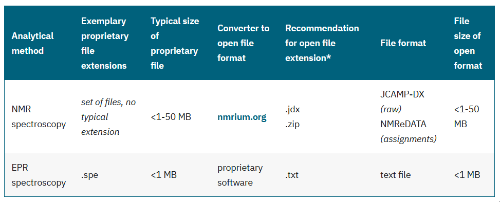

# Advanced stuff

## Downloadable files

Please place downloadable files, e.g. document templates, in the `assets` folder:
```
/static/assets/file.pdf
/static/assets/template.docx
```

In order to link the file in your document, use the following Markdown:

```
[Link text](pathname://../../../assets/file.pdf)
```

The example assumes that your Markdown file is located on the third filesystem level, e.g. `/docs/10_domains/`. If not, please adjust the number of `../` pointers accordingly.


## Format images using `img`

In some cases, the image markdown might be too limited and it might be better to use the `img` html tag. To do so, add the following line at the beginning (but after the [front matter](https://docusaurus.io/docs/create-doc#doc-front-matter)):

```
---
title: "Title of my page"
---

import useBaseUrl from '@docusaurus/useBaseUrl';
```

Where you wish to reference the image, use the `img` html tag in this way:

```

```


## Dynamic tables

### All or individual entries

The use of dynamic table data is possible. The first example is the table with the analytical methods, used for example in the article [Synthetic Organic/Inorganic Chemistry](../docs/10_domains/11_synthetic_chemistry.mdx).

The table data is stored in this file: [/static/assets/methods.json](../static/assets/methods.json)

In your page, you have to include the table generation script with:

```
import MethodsTable from '@site/src/components/methods.js';
```

The table is then generated with `<MethodsTable defaultProfile={ "argument" } />`. You can either use `all` as argument or choose the `name` of the required methods set (currenty available: `synthetic`, `magres`, `physical`, `pharma`).

### Define a set of methods

If required, you can also define your own set of methods in [/static/assets/profiles.json](../static/assets/profiles.json) (use the `shortname` properties of the methods):

```
{
    "name": "magres",
    "longname": "Magnetic Resonance",
    "methods": [ "nmr","epr" ]
},
```

Like above, include the profile table generation script with:

```
import MethodsTable from '@site/src/components/methods.js';
```

You can then generate the table with your set of entries using `<MethodsTable defaultProfile={"magres"} />`, yielding this table:

